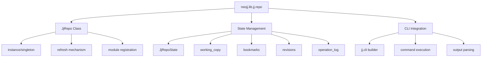
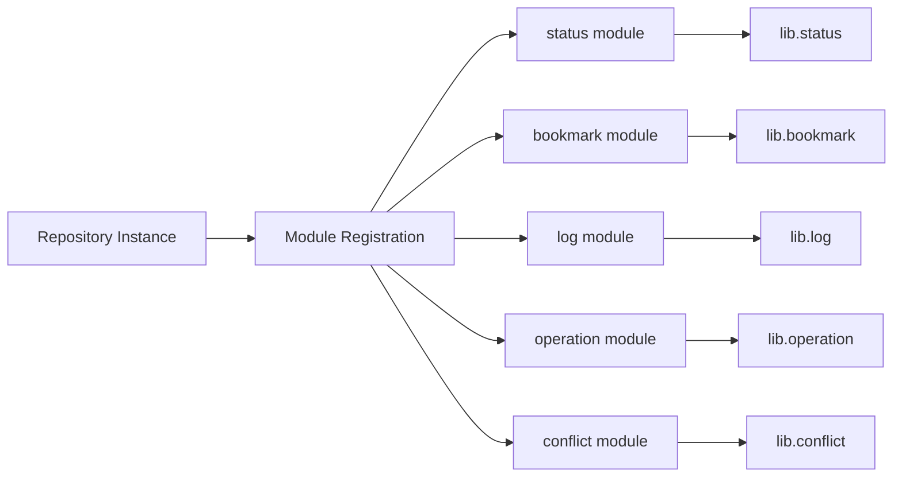
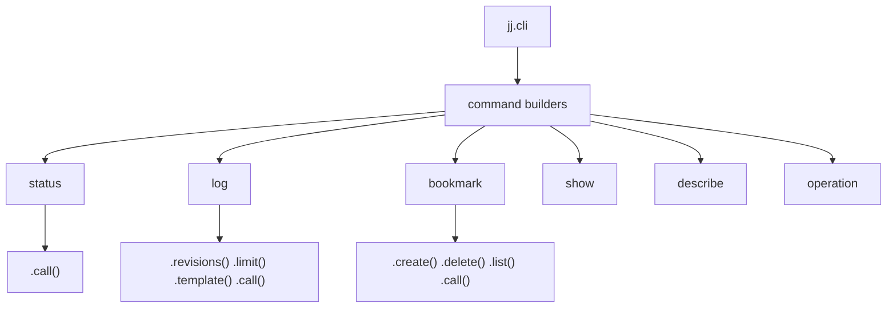
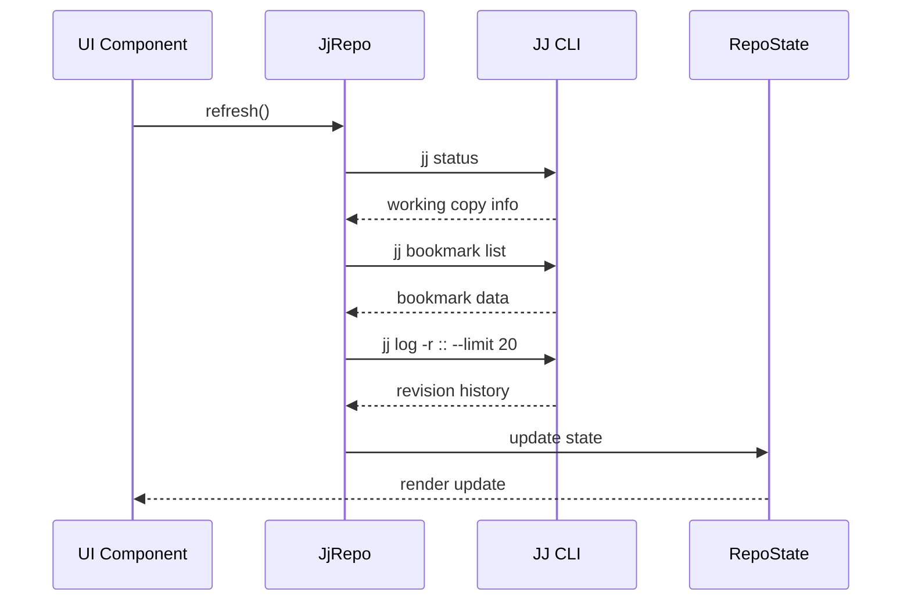

# NeoJJ Implementation Plan

This document outlines the plan to create NeoJJ, a Neovim plugin for managing Jujutsu (jj) repositories, based on the structure and design of Neogit.

## Project Overview

**Goal**: Create `neojj.lib.jj.repo` module that mirrors the functionality of `neogit.lib.git.repo`, adapting it for Jujutsu's unique data model and command structure.

## Analysis Summary

### Neogit Architecture (Reference)

The Neogit project follows these key patterns:

- **Repository Singleton Pattern**: One instance per working directory
- **State Management**: Centralized state with async refresh mechanisms
- **Module Registration**: Git operations self-register with the repository
- **Builder Pattern**: Fluent API for command construction
- **Component-based UI**: Virtual DOM-like rendering system

### Jujutsu vs Git Differences

| Concept | Git | Jujutsu |
|---------|-----|---------|
| Branches | branches | bookmarks |
| Working Directory | staged/unstaged | working-copy commit (@) |
| Commits | SHA-based | Change IDs + Commit IDs |
| Stashing | stash stack | automatic snapshots |
| History | linear with merges | DAG with change evolution |
| Remotes | push/pull | git integration |

## Implementation Plan

### Phase 1: Core Repository Module Structure



### Phase 2: State Structure Design

#### Core State Structure (JjRepoState)

```lua
---@class JjRepoState
---@field root              string           Workspace root directory
---@field jj_dir            string           .jj directory path
---@field working_copy      JjWorkingCopy    Current working copy (@)
---@field bookmarks         JjBookmarks      Local and remote bookmarks
---@field revisions         JjRevisions      Recent revisions for log view
---@field operation_log     JjOperations     Operation history
---@field conflicts         JjConflicts      Conflicted files/changes
---@field remotes          JjRemotes         Git remote integration
```

#### Working Copy State

```lua
---@class JjWorkingCopy
---@field change_id         string           Current change ID
---@field commit_id         string           Current commit ID
---@field description       string           Commit description
---@field author            JjAuthor         Author information
---@field parent_ids        string[]         Parent commit IDs
---@field modified_files    StatusItem[]     Modified files in working copy
---@field conflicts         ConflictItem[]   Conflicted files
---@field is_empty          boolean          Whether working copy has changes
```

#### Bookmark State

```lua
---@class JjBookmarks
---@field local_bookmarks   BookmarkItem[]   Local bookmarks
---@field remote_bookmarks  BookmarkItem[]   Remote tracking bookmarks
---@field conflicted        BookmarkItem[]   Conflicted bookmarks

---@class BookmarkItem
---@field name              string           Bookmark name
---@field target_id         string           Target commit/change ID
---@field remote            string|nil       Remote name if tracking
---@field is_conflicted     boolean          Has conflicts
```

### Phase 3: Module Registration System

Following Neogit's pattern, create modules that self-register:



### Phase 4: CLI Builder System

Create a fluent API for Jujutsu commands:

```lua
-- Example usage patterns
jj.cli.status.call()
jj.cli.log.revisions("@").limit(10).call()
jj.cli.bookmark.create("feature").call()
jj.cli.describe.message("New description").call()
```

#### Command Builder Structure



### Phase 5: File Structure

```
lua/neojj/
├── lib/
│   └── jj/
│       ├── init.lua           -- Main jj lib entry point
│       ├── cli.lua            -- Command builder system
│       ├── repository.lua     -- Core repository management
│       ├── status.lua         -- Working copy status
│       ├── bookmark.lua       -- Bookmark operations
│       ├── log.lua            -- Revision history
│       ├── operation.lua      -- Operation log
│       ├── conflict.lua       -- Conflict resolution
│       └── files.lua          -- File operations
```

### Phase 6: Key Implementation Details

#### Repository Initialization

```lua
local function empty_state()
  return {
    root = "",
    jj_dir = "",
    working_copy = {
      change_id = nil,
      commit_id = nil,
      description = "",
      author = { name = "", email = "" },
      parent_ids = {},
      modified_files = {},
      conflicts = {},
      is_empty = true,
    },
    bookmarks = {
      local_bookmarks = {},
      remote_bookmarks = {},
      conflicted = {},
    },
    revisions = { items = {} },
    operation_log = { items = {} },
    conflicts = { items = {} },
    remotes = { items = {} },
  }
end
```

#### State Refresh Strategy



### Phase 7: Testing Strategy

1. **Unit Tests**: Test individual modules (status, bookmark, log)
1. **Integration Tests**: Test full repository state refresh
1. **CLI Tests**: Mock jj command outputs
1. **State Tests**: Verify state transformations

### Phase 8: Migration Considerations

#### Differences to Handle

1. **No Staging Area**: Jujutsu works directly with working copy commits
1. **Change Evolution**: Track how changes evolve over time
1. **Automatic Snapshots**: No explicit staging/committing needed
1. **Bookmark vs Branch**: Different semantics and behavior
1. **Operation Log**: Jujutsu's operation-based undo system

#### Command Mapping

| Neogit (Git) | NeoJJ (Jujutsu) |
|--------------|-----------------|
| `git status` | `jj status` |
| `git log` | `jj log` |
| `git branch` | `jj bookmark` |
| `git stash` | `jj op log` (operations) |
| `git add/commit` | `jj describe` (working copy) |
| `git reflog` | `jj op log` |

## Success Criteria

1. ✅ **Repository Detection**: Detect .jj directories and initialize repo instances
1. ✅ **State Structure**: Define comprehensive state matching Jujutsu's data model
1. ✅ **CLI Integration**: Build fluent API for jj commands
1. ✅ **Status Display**: Show working copy status with change info
1. ✅ **Module System**: Self-registering modules for different jj operations
1. ✅ **Async Refresh**: Non-blocking repository state updates

## Next Steps

1. Implement basic `neojj.lib.jj.repository` with empty state
1. Create `neojj.lib.jj.cli` command builder
1. Implement `neojj.lib.jj.status` module
1. Add repository detection and initialization
1. Test with actual jj repository
1. Add a UI layer that mimics `:Neogit cwd=%:p:h`. (ie. the main UI page that shows status plus recent log.)
1. Iterate on state structure based on real usage

This plan provides a solid foundation for creating NeoJJ while maintaining compatibility with Neogit's architecture and design patterns.

