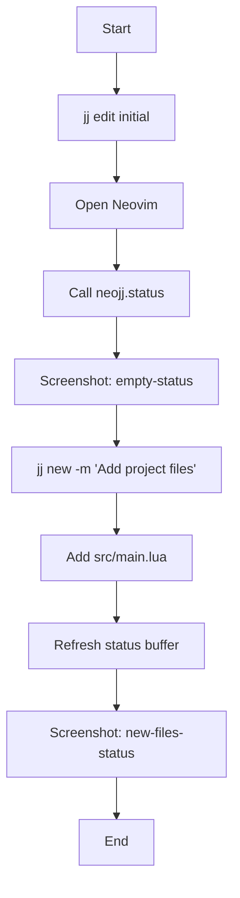
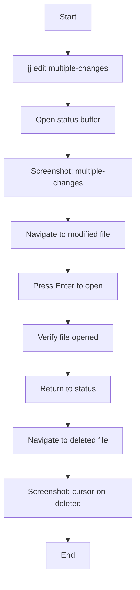
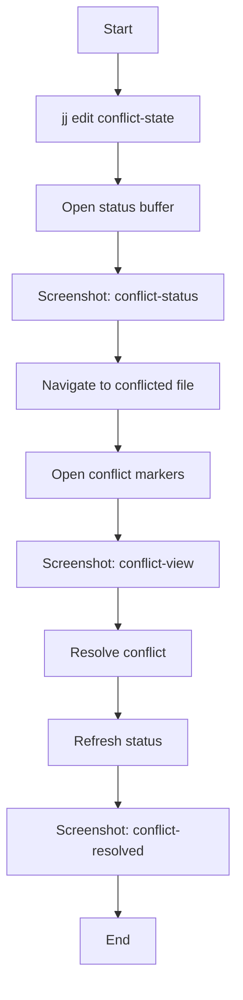
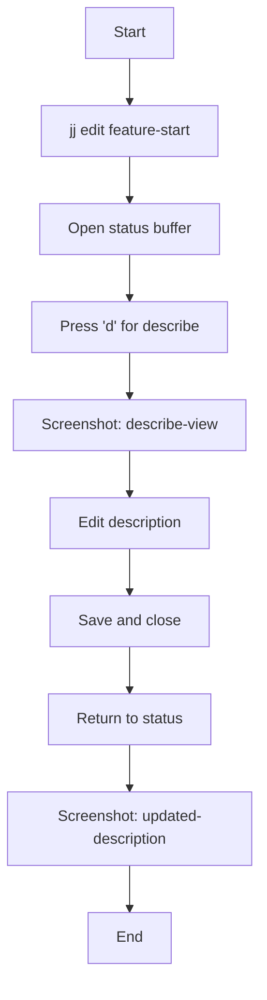

# NeoJJ Integration Testing Plan

## Overview

This document outlines the integration testing strategy for NeoJJ using a reference Jujutsu repository and visual regression testing with screenshots.

## Test Infrastructure

### 1. Reference Repository Setup

Create a demo JJ repository at `tests/fixtures/demo-repo/` with the following structure:

```
demo-repo/
├── .jj/
├── src/
│   ├── main.lua
│   ├── utils.lua
│   └── config.lua
├── tests/
│   └── test_main.lua
├── docs/
│   └── README.md
└── .gitignore
```

### 2. Repository States

The demo repo will have several known commit states that we can navigate to:

- `initial`: Empty repository with just .gitignore
- `feature-start`: Basic project structure added
- `conflict-state`: Two branches with conflicting changes
- `multiple-changes`: Working copy with various file states (added, modified, deleted)
- `merge-state`: Active merge with resolved and unresolved conflicts

## Test Workflows

### Workflow 1: Basic Status Display



### Workflow 2: File Interaction



### Workflow 3: Conflict Resolution



### Workflow 4: Commit Description



## Implementation Details

### Test Structure Using MiniTest

Create integration tests in `tests/test_integration_workflows.lua` using MiniTest framework:

```lua
local T = MiniTest.new_set()
local expect = MiniTest.expect
local child = MiniTest.new_child_neovim()

T.hooks = {
    pre_case = function()
        child.restart({ "-u", "scripts/minimal_init.lua" })
        child.bo.readonly = false
        child.o.lines = 40
        child.o.columns = 120
        
        -- Setup test environment
        child.cmd([[ set rtp+=deps/plenary.nvim ]])
        child.lua([[ M = require('neojj') ]])
        child.lua([[ M.setup() ]])
        child.lua([[ expect = require('mini.test').expect ]])
        
        -- Mock JJ CLI to use test repository
        child.lua([[
            local JJ = require('neojj.lib.jj.cli')
            JJ._test_mode = true
            JJ._test_repo_path = vim.fn.fnamemodify('tests/fixtures/demo-repo', ':p')
        ]])
    end,
    post_once = child.stop,
}
```

### Screenshot Testing with MiniTest

Each workflow test will use `expect.reference_screenshot()`:

```lua
T.test_workflow_basic_status = function()
    -- Set repository to initial state
    child.lua([[
        local JJ = require('neojj.lib.jj.cli')
        JJ.run({ "edit", "initial" })
    ]])
    
    -- Open status buffer
    child.lua([[ M.status() ]])
    
    -- Wait for render
    child.lua([[ vim.cmd('redraw') ]])
    
    -- Take reference screenshot
    expect.reference_screenshot(child.get_screenshot(), {
        reference_file = 'tests/screenshots/workflow-basic-status-empty.png'
    })
    
    -- Continue workflow...
end
```

### Screenshot Management

MiniTest handles screenshot comparison automatically:

- Reference screenshots stored in `tests/screenshots/`
- Named with pattern: `tests-{filename}---{test_name}`
- Automatic comparison on test run
- Failed comparisons show diff in test output

### Test Execution

```bash
# Run all integration workflow tests
make test_file FILE=tests/test_integration_workflows.lua

# Run within nix environment
nix develop --command make test_file FILE=tests/test_integration_workflows.lua

# Update reference screenshots (after visual verification)
# Simply delete the old screenshot and re-run the test to generate new reference
rm tests/screenshots/tests-test_integration_workflows---test_workflow_basic_status.png
make test_file FILE=tests/test_integration_workflows.lua
```

## Test Data Generation

### Real JJ Repository Setup

Create a demo JJ repository with known states that tests can navigate to:

#### Setup Script: `tests/fixtures/create-demo-repo.sh`

```bash
#!/bin/bash
# Creates the demo repository with all required states

set -e

REPO_DIR="tests/fixtures/demo-repo"

# Clean up any existing repo
rm -rf "$REPO_DIR"
mkdir -p "$REPO_DIR"
cd "$REPO_DIR"

# Initialize repository
jj init

# Create initial state - empty repo
echo "*.swp" > .gitignore
echo "temp/" >> .gitignore
jj describe -m "Initial commit"
jj bookmark create initial

# Create feature-start state - basic project structure
jj new
mkdir -p src tests docs
cat > src/main.lua << 'EOF'
-- Main module
local M = {}

function M.hello()
    return "Hello from NeoJJ test"
end

return M
EOF

cat > src/utils.lua << 'EOF'
-- Utility functions
local U = {}

function U.format(str)
    return string.upper(str)
end

return U
EOF

cat > tests/test_main.lua << 'EOF'
-- Test file
local main = require('src.main')

assert(main.hello() == "Hello from NeoJJ test")
EOF

jj describe -m "Add project structure"
jj bookmark create feature-start

# Create conflict state
# Branch 1: Add config with one implementation
jj new initial
mkdir -p src
cat > src/config.lua << 'EOF'
-- Configuration v1
return {
    version = "1.0",
    feature_flag = true
}
EOF
jj describe -m "Add config (version 1)"
jj bookmark create config-v1

# Branch 2: Add config with different implementation
jj new initial
mkdir -p src
cat > src/config.lua << 'EOF'
-- Configuration v2
return {
    version = "2.0",
    feature_flag = false,
    new_option = "added"
}
EOF
jj describe -m "Add config (version 2)"
jj bookmark create config-v2

# Create merge with conflict
jj new config-v1
jj merge config-v2
jj describe -m "Merge: Add config versions"
jj bookmark create conflict-state

# Create multiple-changes state
jj new feature-start

# Modify existing file
cat >> src/main.lua << 'EOF'

function M.new_feature()
    return "This is new"
end
EOF

# Delete a file
rm src/utils.lua

# Add new file
cat > tests/test_new.lua << 'EOF'
-- New test file
print("New test")
EOF

# Create untracked file
echo "temporary file" > temp.txt

jj describe -m "Work in progress: multiple changes"
jj bookmark create multiple-changes

# Create merge-state with resolved and unresolved conflicts
jj new feature-start
echo "Additional content" >> src/main.lua
jj describe -m "Modify main.lua"
jj bookmark create modify-main

jj new feature-start
echo "Different content" >> src/main.lua
mkdir -p src/components
echo "-- New component" > src/components/ui.lua
jj describe -m "Add components"
jj bookmark create add-components

jj new modify-main
jj merge add-components
# This creates a conflict in main.lua but not in ui.lua
jj describe -m "Merge: Features in progress"
jj bookmark create merge-state

echo "Demo repository created successfully!"
echo "Available bookmarks:"
jj bookmark list
```

#### Test Helper to Change Repository State

```lua
-- In test setup
child.lua([[
    -- Helper to switch to a known repository state
    function switch_to_state(bookmark_name)
        local JJ = require('neojj.lib.jj.cli')
        local result = JJ.run({ "edit", bookmark_name }, {
            cwd = vim.fn.fnamemodify('tests/fixtures/demo-repo', ':p')
        })
        
        if result.code ~= 0 then
            error("Failed to switch to state " .. bookmark_name .. ": " .. result.stderr)
        end
        
        -- Give JJ time to update working copy
        vim.wait(100)
        
        return result
    end
    
    -- Set working directory to demo repo
    vim.cmd('cd ' .. vim.fn.fnamemodify('tests/fixtures/demo-repo', ':p'))
]])

## Success Criteria

1. **Reproducibility**: Tests produce identical results across runs
2. **Coverage**: All major UI states and interactions are tested
3. **Performance**: Full test suite runs in under 2 minutes
4. **Maintainability**: Easy to add new test cases and update baselines
5. **Debugging**: Clear error messages and visual diffs when tests fail

## Complete Workflow Test Examples

### Basic Status Display Test

```lua
T.test_workflow_basic_status = function()
    -- Ensure demo repo exists
    child.lua([[
        local demo_repo_path = vim.fn.fnamemodify('tests/fixtures/demo-repo', ':p')
        if vim.fn.isdirectory(demo_repo_path) == 0 then
            error("Demo repository not found. Run: tests/fixtures/create-demo-repo.sh")
        end
    ]])
    
    -- Test empty repository
    child.lua([[ 
        switch_to_state("initial")
        vim.cmd('cd ' .. vim.fn.fnamemodify('tests/fixtures/demo-repo', ':p'))
    ]])
    
    child.lua([[ M.status() ]])
    child.lua([[ vim.wait(200) ]]) -- Wait for async operations
    child.lua([[ vim.cmd('redraw') ]])
    
    expect.reference_screenshot(child.get_screenshot())
    
    -- Switch to state with files
    child.lua([[
        switch_to_state("feature-start")
        
        -- Refresh status buffer
        local StatusBuffer = require('neojj.buffers.status')
        if StatusBuffer.current then
            StatusBuffer.current:refresh()
        end
        
        vim.wait(200) -- Wait for refresh
        vim.cmd('redraw')
    ]])
    
    expect.reference_screenshot(child.get_screenshot())
end
```

### File Interaction Test

```lua
T.test_workflow_file_interaction = function()
    -- Set up repository with changes
    child.lua([[
        switch_to_state("multiple-changes")
        vim.cmd('cd ' .. vim.fn.fnamemodify('tests/fixtures/demo-repo', ':p'))
    ]])
    
    child.lua([[ M.status() ]])
    child.lua([[ vim.wait(200) ]])
    child.lua([[ vim.cmd('redraw') ]])
    
    -- Take screenshot of full status
    expect.reference_screenshot(child.get_screenshot())
    
    -- Navigate to modified file
    child.lua([[
        -- Find line with src/main.lua
        vim.fn.search('src/main.lua')
        vim.cmd('redraw')
    ]])
    
    expect.reference_screenshot(child.get_screenshot())
    
    -- Test file opening
    child.lua([[
        -- Track if file was opened
        local opened_file = nil
        local original_cmd = vim.cmd
        vim.cmd = function(cmd_str)
            if type(cmd_str) == "string" and cmd_str:match("^edit ") then
                opened_file = cmd_str:match("^edit (.+)$")
            end
            return original_cmd(cmd_str)
        end
        
        -- Trigger <CR> mapping
        vim.api.nvim_feedkeys(vim.api.nvim_replace_termcodes("<CR>", true, false, true), "n", false)
        vim.wait(100)
        
        -- Restore original vim.cmd
        vim.cmd = original_cmd
        
        -- Verify the correct file was opened
        expect.equality(opened_file, "src/main.lua")
    ]])
end
```

### Conflict State Test

```lua
T.test_workflow_conflict_display = function()
    -- Switch to conflict state
    child.lua([[
        switch_to_state("conflict-state")
        vim.cmd('cd ' .. vim.fn.fnamemodify('tests/fixtures/demo-repo', ':p'))
    ]])
    
    child.lua([[ M.status() ]])
    child.lua([[ vim.wait(200) ]])
    child.lua([[ vim.cmd('redraw') ]])
    
    -- Screenshot showing conflict markers
    expect.reference_screenshot(child.get_screenshot())
    
    -- Navigate to conflicted file
    child.lua([[
        vim.fn.search('src/config.lua')
        vim.cmd('redraw')
    ]])
    
    expect.reference_screenshot(child.get_screenshot())
end
```

## Next Steps

1. Create `tests/test_integration_workflows.lua` with the MiniTest structure
2. Implement JJ CLI mocking in the test setup
3. Write the workflow tests using reference screenshots
4. Run tests to generate initial reference screenshots
5. Add to CI pipeline
6. Document how to add new workflow tests

## Considerations

### Platform Differences

- Font rendering may vary between platforms
- Use tolerance thresholds for image comparison
- Consider platform-specific baselines if needed

### Neovim Configuration

- Use minimal init.lua for testing
- Disable user plugins and configs
- Set consistent colorscheme and dimensions

### Async Operations

- Add appropriate waits for JJ operations
- Ensure UI is fully rendered before screenshots
- Handle potential race conditions

## Alternative Approaches Considered

1. **DOM-based testing**: Parse buffer contents instead of screenshots
   - Pros: More precise, faster
   - Cons: Doesn't catch visual regressions

2. **Recorded interactions**: Use Neovim's input recording
   - Pros: Natural test creation
   - Cons: Brittle, hard to maintain

3. **Property-based testing**: Generate random repo states
   - Pros: Better coverage
   - Cons: Non-deterministic, hard to debug

The screenshot-based approach was chosen for its ability to catch visual regressions while remaining relatively simple to implement and debug.
