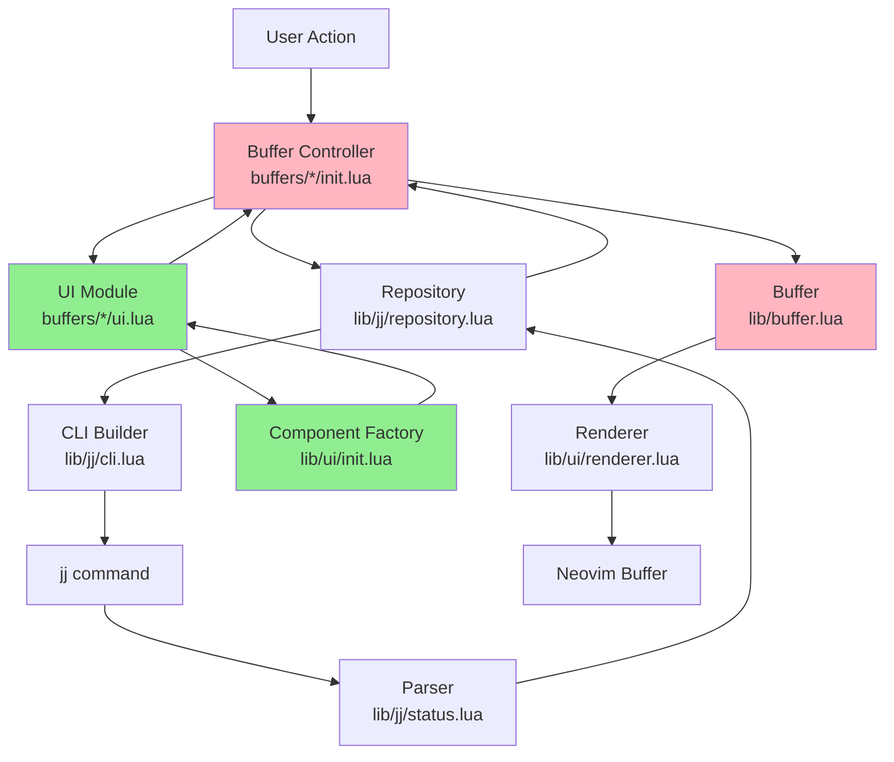
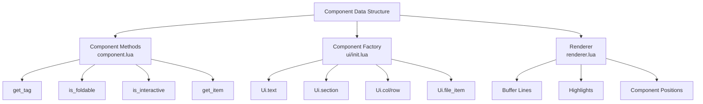
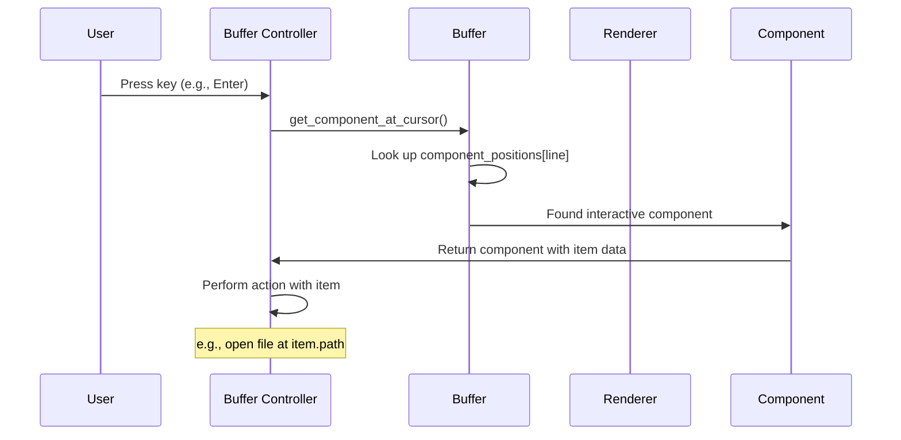

# NeoJJ Module Architecture

This document explains the module structure and naming patterns in NeoJJ.

## Directory Structure

```
lua/
├── neojj.lua                    # Plugin entry point
└── neojj/
    ├── buffers/                 # Buffer implementations (one per UI view)
    │   ├── status/
    │   │   ├── init.lua        # StatusBuffer class (lifecycle & state)
    │   │   └── ui.lua          # StatusUI (pure component creation)
    │   ├── describe/
    │   ├── log/
    │   └── commit/
    ├── lib/                     # Reusable libraries
    │   ├── ui/                  # UI component system
    │   │   ├── component.lua   # Component abstraction
    │   │   ├── renderer.lua    # Renders components to buffer lines
    │   │   └── init.lua        # Component factory (Ui.text(), Ui.section(), etc)
    │   ├── jj/                  # JJ version control integration
    │   │   ├── cli.lua         # Builder for jj commands (Cli:arg():call())
    │   │   ├── repository.lua  # Repository state & caching (singleton)
    │   │   ├── status.lua      # Parse jj status output
    │   │   └── util.lua        # Shared utilities
    │   └── buffer.lua          # Generic buffer management
    ├── logger.lua              # Logging infrastructure
    └── highlights.lua          # Highlight group definitions
```

## Module Responsibilities

### 1. `buffers/{name}/init.lua` - Buffer Controllers

**Role**: Stateful buffer lifecycle management

**Responsibilities**:
- Create, open, close, refresh buffers
- State management (expanded files, cursor position, etc.)
- Event handling (keybindings, autocmds)
- Coordinate between repository, UI components, and Neovim buffers

**Pattern**: Singleton per repository
```lua
function StatusBuffer.new(repo)
    -- Returns existing instance if available
    -- Otherwise creates new instance
end
```

**Example**: `StatusBuffer` manages the status view lifecycle

### 2. `buffers/{name}/ui.lua` - Pure UI Logic

**Role**: Pure component creation functions

**Responsibilities**:
- Build component trees from data
- Define visual layout and structure
- **NO state mutations**
- **NO side effects** (no buffer operations, no jj calls)

**Pattern**: Pure functions
```lua
function StatusUI.create(repo_state)
    -- Takes data, returns components
    return {
        Ui.section("Files", {...})
    }
end
```

**Why separate**: Makes UI logic easy to test and reason about

### 3. `lib/buffer.lua` - Generic Buffer Abstraction

**Role**: Neovim buffer wrapper

**Responsibilities**:
- Create and configure Neovim buffers
- Set buffer options and properties
- Setup keybindings and autocmds
- Component rendering (delegates to renderer)
- Position tracking (map cursor to interactive components)

**Used by**: All buffer types (status, describe, log, commit)

### 4. `lib/ui/component.lua` - Component System

**Role**: Component data structure and methods

**Responsibilities**:
- Define component structure (tag, children, options, value)
- Component query methods (get_tag, is_foldable, is_interactive)
- Immutable data structures

**Pattern**: Components are just data
```lua
{
    tag = "Text",
    value = "hello",
    options = { highlight = "Foo" },
    children = {}
}
```

### 5. `lib/ui/renderer.lua` - Rendering Engine

**Role**: Convert components to buffer lines

**Responsibilities**:
- Walk component tree depth-first
- Generate buffer lines with content
- Track highlight positions
- Record interactive component positions (for cursor interaction)

**Output**:
- Lines array
- Highlights array
- Component positions map

### 6. `lib/ui/init.lua` - Component Factory

**Role**: Convenient component constructors

**Responsibilities**:
- Provide factory functions for common components
- Generic: `Ui.text()`, `Ui.section()`, `Ui.col()`, `Ui.row()`
- Domain-specific: `Ui.commit_info()`, `Ui.file_item()`

**Pattern**: All return component data structures
```lua
Ui.text("hello", { highlight = "Title" })
-- Returns: { tag = "Text", value = "hello", options = {...} }
```

### 7. `lib/jj/cli.lua` - Command Builder

**Role**: Fluent interface for building jj commands

**Responsibilities**:
- Build jj command with arguments
- Execute commands asynchronously
- Return structured results (success, stdout, stderr)

**Pattern**: Method chaining
```lua
Cli.status()
    :option("revision", "@")
    :cwd(dir)
    :call()
```

### 8. `lib/jj/repository.lua` - Repository State

**Role**: Repository abstraction with caching

**Responsibilities**:
- Singleton per directory
- Cache repository state
- Coordinate refreshes (prevent concurrent calls)
- Detect repository root

**Pattern**: Instance caching
```lua
function JjRepo.instance(dir)
    if not instances[dir] then
        instances[dir] = JjRepo.new(dir)
    end
    return instances[dir]
end
```

### 9. `lib/jj/status.lua` - Status Module

**Role**: Coordinate status refresh using parsers

**Responsibilities**:
- Orchestrate jj status and jj log calls
- Use isolated parsers to extract structured data
- Merge status output (files) with log output (metadata)
- Update repository state

### 10. `lib/jj/parsers/` - Parser Modules

**Role**: Pure parsing functions for jj command output

**Design Philosophy**: All parsers are pure functions with no side effects

#### 10.1 `parsers/status_parser.lua`

**Responsibilities**:
- Parse `jj status` output using regex patterns
- Extract working copy info, modified files (M/A/D), conflicts (C)
- Return structured `WorkingCopy` data

**Pattern**: Pure function - string input → structured data output

```lua
local working_copy = status_parser.parse_working_copy_info(lines)
-- Returns: WorkingCopy table with change_id, modified_files, etc.
```

**Note**: `jj status` does NOT support templates, so regex parsing is required

#### 10.2 `parsers/log_parser.lua`

**Responsibilities**:
- Parse `jj log` graph output using regex patterns
- Extract revision metadata (change_id, author, timestamp, commit_id)
- Preserve ASCII graph characters for visual display
- Track component positions for interactive navigation

**Pattern**: Pure function - string input → structured data output

```lua
local parsed = log_parser.parse_log_output(output)
-- Returns: ParsedLog with revisions[], graph_data{}, raw_lines[]
```

**Use case**: Log buffer needs visual graph, so parses default output instead of JSON

#### 10.3 `parsers/json_parser.lua`

**Responsibilities**:
- Parse JSON output from `jj log -T 'json(self)'`
- Validate and decode JSON using `vim.json.decode()`
- Convert `JjLogJson` to `WorkingCopy` format
- Handle multi-line JSON output (one object per line)

**Pattern**: Pure functions for JSON parsing and conversion

```lua
local log_json, err = json_parser.parse_log_json(json_str)
local working_copy = json_parser.json_to_working_copy(log_json)
```

**Advantages**:
- Clean, structured data from jj (no regex fragility)
- Access to full commit metadata
- Type-safe with LuaLS annotations

**Used by**: `status.lua` and `describe` buffer for metadata extraction

### 11. `lib/jj/types.lua` - Type Definitions

**Role**: LuaLS type annotations for all data structures

**Responsibilities**:
- Define types for working copy, modified files, conflicts, etc.
- Define types for log revisions and graph data
- Define types for JSON output from jj
- Enable static type checking with lua-language-server

**Key Types**:
- `WorkingCopy` - Repository working copy state
- `ModifiedFile` - File with status (M/A/D)
- `LogRevision` - Single commit from log output
- `JjLogJson` - Parsed JSON from jj log command

### 12. `lib/jj/util.lua` - JJ Utilities

**Role**: Shared utility functions for jj integration

## Key Design Principle: Separation of Concerns

The `init.lua` / `ui.lua` split in buffers is crucial for maintainability:

```lua
-- buffers/status/init.lua - IMPURE (side effects allowed)
function StatusBuffer:refresh()
    -- Side effect: call jj
    self.state = self.repo:get_status()

    -- Pure call: just data transformation
    local components = StatusUI.create(self.state)

    -- Side effect: modify Neovim buffer
    self.buffer:render(components)
end

-- buffers/status/ui.lua - PURE (no side effects)
function StatusUI.create(repo_state)
    -- Just returns data, no mutations
    return {
        Ui.section("Files", {
            Ui.file_item("M", "file.lua")
        })
    }
end
```

### Benefits:

1. **Testability**: `ui.lua` is pure functions - easy to test without mocking
2. **Readability**: Clear separation between "what to show" and "how to manage it"
3. **Reusability**: Pure UI functions can be composed and reused
4. **Debugging**: Side effects are isolated to `init.lua`

## Data Flow



**Legend**:
- 🟢 Green: Pure functions (no side effects)
- 🔴 Pink: Impure (manages state and side effects)

## Component Architecture



## Module Import Pattern: Lazy Requires

NeoJJ uses **lazy requires** - modules are required inside functions rather than at the top level:

```lua
-- Instead of top-level:
-- local Jj = require("neojj.lib.jj")

-- Require inside function:
function M.some_function()
    local Jj = require("neojj.lib.jj")
    -- use Jj
end
```

### Benefits:
1. **Breaks circular dependencies**
2. **Faster plugin startup** (modules load on-demand)
3. **Easier testing** (mock via `package.loaded` before function call)

See `tests/CLAUDE.md` section "Mocking Dependencies with package.loaded" for details.

## Interactive Component System

Components can be marked as `interactive` to support cursor-based actions:



### How it works:

1. **Component Creation**: Mark components interactive
   ```lua
   Ui.file_item(status, path, {
       item = { path = "file.txt", status = "M" },
       interactive = true
   })
   ```

2. **Rendering**: Renderer tracks positions
   ```lua
   component_positions[line_number] = component
   ```

3. **Interaction**: Buffer finds component at cursor
   ```lua
   local component = buffer:get_component_at_cursor()
   if component and component:is_interactive() then
       local item = component:get_item()
       -- Use item.path, item.status, etc.
   end
   ```

## Adding New Buffer Types

To add a new buffer type (e.g., `branches`):

1. **Create directory**: `lua/neojj/buffers/branches/`

2. **Create `init.lua`** (controller):
   - Define `BranchesBuffer` class
   - Implement `new()`, `refresh()`, `close()`
   - Setup keybindings with `_setup_mappings()`
   - Handle user interactions

3. **Create `ui.lua`** (pure UI):
   - Define `BranchesUI.create(data)`
   - Return component tree
   - Keep pure - no state, no side effects

4. **Register command** in `lua/neojj.lua`:
   ```lua
   vim.api.nvim_create_user_command("JJBranches", function(args)
       M.jj_branches(nil, args.args)
   end, {...})
   ```

5. **Add tests**:
   - Test component creation in `ui.lua`
   - Test buffer lifecycle in `init.lua`
   - Add screenshot tests if needed

## Best Practices

1. **Keep `ui.lua` pure**: No side effects, just data transformation
2. **Use lazy requires**: Require modules inside functions for better startup and testing
3. **Singleton buffers**: One buffer instance per repository (via instance caching)
4. **Interactive components**: Store item data for cursor-based actions
5. **Component composition**: Build complex UIs from simple components
6. **Async JJ calls**: Use plenary.async to avoid blocking editor
7. **Cache repository state**: Prevent redundant jj command execution
8. **Isolated parsers**: Keep parsing logic separate from business logic for testability
9. **Use JSON where possible**: Prefer `jj -T 'json(self)'` over regex parsing when available
10. **Test with fixtures**: Use real jj outputs as test fixtures for parser validation

## Testing Strategy

### Parser Testing with Fixtures

All parsers are tested using real jj command output stored in `tests/fixtures/jj-outputs/`:

**Status Parser Fixtures**:
- `status-clean.txt` - Clean working copy
- `status-modified.txt` - Modified files (M/A/D)
- `status-conflicts.txt` - Conflicted files
- `status-merge.txt` - Multiple parents

**Log Parser Fixtures**:
- `log-graph-simple.txt` - Linear history with ASCII graph
- `log-graph-merge.txt` - Merge commits with complex graph

**JSON Parser Fixtures**:
- `log-json-working-copy.json` - Full JSON output from `jj log -T 'json(self)'`

### Parser Tests

Each parser has comprehensive tests in `tests/`:
- `test_status_parser.lua` - Test status regex parsing
- `test_log_parser.lua` - Test log graph parsing
- `test_json_parser.lua` - Test JSON parsing and conversion

**Pattern**: Pure parser functions make testing easy - just pass fixture data, assert output structure

### Hybrid Parsing Strategy

NeoJJ uses a **hybrid approach** to parsing jj output:

1. **Use JSON templates** where supported (`jj log`, `jj show`, etc.):
   ```lua
   cli.log():option("template", "json(self)")
   -- Parse with json_parser.parse_log_json()
   ```

2. **Use regex parsing** where templates not supported (`jj status`):
   ```lua
   cli.status()  -- No template support
   -- Parse with status_parser.parse_working_copy_info()
   ```

3. **Keep graph parsing** for visual output (log buffer):
   ```lua
   cli.log()  -- Default output with ASCII graph
   -- Parse with log_parser.parse_log_output()
   ```

**Rationale**: JSON provides clean, stable data but isn't universal. Regex is fragile but sometimes necessary. Test both thoroughly.
