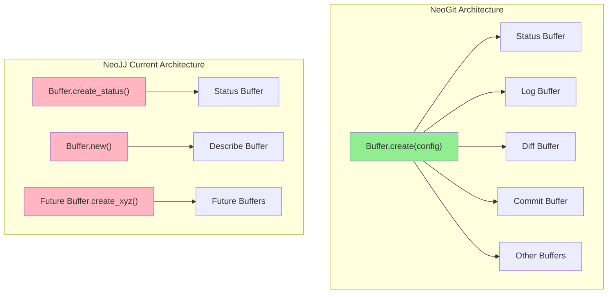
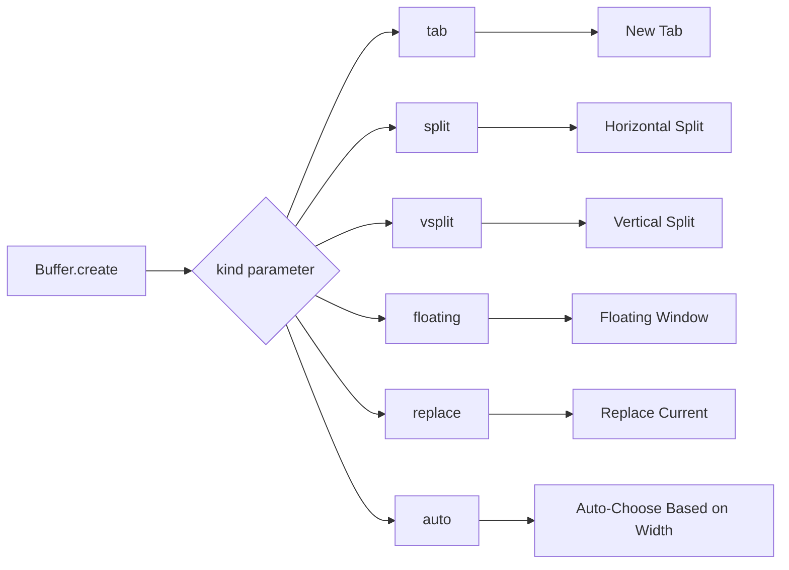
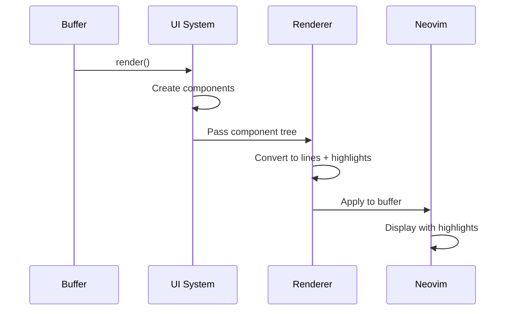
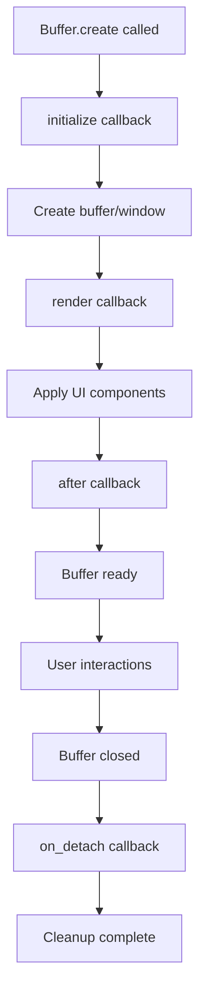
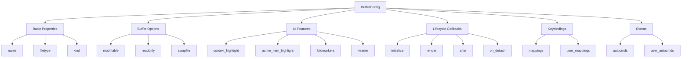

# NeoGit Buffer Creation Architecture Analysis

## Overview

This document provides a detailed analysis of NeoGit's buffer creation system and how it could be applied to improve NeoJJ's architecture. NeoGit uses a sophisticated, unified approach that provides consistency, flexibility, and maintainability across all buffer types.

## Current Architecture Comparison



## 1. Unified Factory Pattern

### NeoGit's Approach

NeoGit uses a single `Buffer.create(config)` method that handles all buffer types through configuration rather than specialized factory methods:

```lua
-- NeoGit approach - single unified factory
local buffer = Buffer.create {
  name = "NeogitStatus",
  filetype = "NeogitStatus", 
  kind = "tab",
  render = function() return ui.Status(...) end,
  mappings = { ... },
  -- ... other config
}
```

### NeoJJ's Current Mixed Approach

```lua
-- NeoJJ's current mixed approach
local status_buffer = Buffer.create_status(...)  -- specialized factory
local describe_buffer = Buffer.new(...)          -- direct instantiation
```

## 2. Comprehensive Configuration System

NeoGit's config object supports extensive customization:

```lua
Buffer.create {
  -- Basic properties
  name = "NeogitStatus",
  filetype = "NeogitStatus",
  kind = "tab",                    -- display mode
  
  -- Buffer behavior
  modifiable = false,
  readonly = true,
  swapfile = false,
  
  -- UI features
  context_highlight = true,        -- highlight related content
  active_item_highlight = true,    -- highlight current item
  foldmarkers = true,             -- show fold markers
  header = "Git Status",          -- floating header
  scroll_header = false,
  
  -- Lifecycle callbacks
  initialize = function() end,     -- pre-display setup
  render = function() end,         -- UI component rendering
  after = function() end,          -- post-display setup
  on_detach = function() end,      -- cleanup
  
  -- Keybindings
  mappings = {
    n = { ["<cr>"] = action1 },
    v = { ["<cr>"] = action2 },
  },
  user_mappings = config.get_user_mappings("status"),
  
  -- Events
  autocmds = {
    ["BufEnter"] = function() end,
  },
  user_autocmds = {
    ["NeogitRefresh"] = function() end,
  },
}
```

## 3. Display Mode Flexibility



NeoGit supports multiple window display modes:

```lua
-- Different ways to display the same buffer
Buffer.create { kind = "tab" }           -- new tab
Buffer.create { kind = "split" }         -- horizontal split
Buffer.create { kind = "vsplit" }        -- vertical split  
Buffer.create { kind = "floating" }      -- floating window
Buffer.create { kind = "replace" }       -- replace current buffer
Buffer.create { kind = "auto" }          -- choose based on terminal width
```

## 4. Deep UI Integration

The Buffer class integrates tightly with the UI component system:



```lua
-- Buffer creation includes render function
Buffer.create {
  render = function()
    return ui.Status(repo.state, config)
  end,
}

-- UI components return hierarchical structures
local ui_components = {
  col {
    text("JJ Status", { highlight = "NeoJJTitle" }),
    row {
      text("Change: "),
      text(change_id, { highlight = "NeoJJChangeId" }),
    },
    section("Files", files_component),
  }
}
```

## 5. Lifecycle Management



NeoGit provides clear lifecycle hooks:

```lua
Buffer.create {
  initialize = function()
    -- Setup before buffer is shown
    -- Load data, validate state, etc.
  end,
  
  render = function()
    -- Return UI components to display
    return ui.Status(data)
  end,
  
  after = function(buffer, win)
    -- Setup after buffer is displayed
    -- Set cursor position, focus, etc.
    buffer:move_cursor(2)
  end,
  
  on_detach = function()
    -- Cleanup when buffer is closed
    -- Save state, stop timers, etc.
  end,
}
```

## 6. Buffer Type Implementation Examples

### Status Buffer Pattern

```lua
function M:open(kind)
  self.buffer = Buffer.create {
    name = "NeogitStatus",
    filetype = "NeogitStatus",
    cwd = self.cwd,
    context_highlight = not config.values.disable_context_highlighting,
    kind = kind or config.values.kind or "tab",
    foldmarkers = not config.values.disable_signs,
    active_item_highlight = true,
    mappings = {
      v = { -- Visual mode mappings
        [mappings["Stage"]] = self:_action("v_stage"),
        -- ... more mappings
      },
      n = { -- Normal mode mappings
        [mappings["Stage"]] = self:_action("n_stage"),
        -- ... more mappings
      },
    },
    user_mappings = config.get_user_mappings("status"),
    initialize = function()
      -- Setup logic
    end,
    render = function()
      return ui.Status(git.repo.state, self.config)
    end,
    after = function(buffer, _win)
      -- Post-creation setup
    end,
    user_autocmds = {
      ["NeogitReset"] = self:deferred_refresh("reset"),
    },
    autocmds = {
      ["FocusGained"] = self:deferred_refresh("focused", 10),
    },
  }
end
```

### Log Buffer Pattern

```lua
self.buffer = Buffer.create {
  name = "NeogitLogView",
  filetype = "NeogitLogView",
  kind = config.values.log_view.kind,
  context_highlight = false,
  header = self.header,
  scroll_header = false,
  active_item_highlight = true,
  status_column = not config.values.disable_signs and "" or nil,
  mappings = {
    -- Buffer-specific mappings
  },
  render = function()
    return ui.View(self.commits, self.remotes, self.internal_args)
  end,
  after = function(buffer)
    buffer:move_cursor(2)
  end,
}
```

## 7. Configuration Architecture



## 8. How NeoJJ Could Adopt This Pattern

### Proposed Unified Approach

```lua
-- New unified NeoJJ buffer creation
local status_buffer = Buffer.create {
  name = "NeoJJStatus",
  filetype = "neojj-status",
  kind = "split",
  
  -- Use component-based rendering
  render = function()
    return require("neojj.buffers.status.ui").create_status_ui(repo.state)
  end,
  
  -- Status-specific mappings
  mappings = {
    n = {
      ["<cr>"] = function() actions.stage_file() end,
      ["d"] = function() actions.diff_file() end,
    },
  },
  
  -- Auto-refresh on file changes
  autocmds = {
    ["BufWritePost"] = function() self:refresh() end,
  },
}

-- Describe buffer using same pattern
local describe_buffer = Buffer.create {
  name = "NeoJJDescribe",
  filetype = "neojj-describe",
  kind = "split",
  modifiable = true,
  
  render = function()
    return require("neojj.buffers.describe.ui").create_describe_ui(commit)
  end,
  
  mappings = {
    n = {
      ["<C-s>"] = function() actions.save_description() end,
    },
  },
}
```

## 9. Key Architectural Benefits

```chart
{
  "type": "radar",
  "data": {
    "labels": ["Consistency", "Flexibility", "Maintainability", "Extensibility", "Feature Integration", "User Customization"],
    "datasets": [{
      "label": "NeoGit Approach",
      "data": [9, 9, 8, 9, 9, 8],
      "backgroundColor": "rgba(144, 238, 144, 0.2)",
      "borderColor": "rgba(144, 238, 144, 1)",
      "borderWidth": 2
    }, {
      "label": "NeoJJ Current",
      "data": [4, 5, 6, 5, 4, 5],
      "backgroundColor": "rgba(255, 182, 193, 0.2)",
      "borderColor": "rgba(255, 182, 193, 1)",
      "borderWidth": 2
    }]
  },
  "options": {
    "scale": {
      "ticks": {
        "beginAtZero": true,
        "max": 10
      }
    }
  }
}
```

### Benefits Breakdown

1. **Consistency**: All buffers follow the same creation pattern
2. **Flexibility**: Rich configuration without subclassing
3. **Maintainability**: Clear separation of concerns
4. **Extensibility**: Easy to add new buffer types
5. **Feature Integration**: Built-in support for advanced features
6. **User Customization**: Standardized way to override behavior

## 10. Migration Path for NeoJJ

```mermaid
gantt
    title NeoJJ Buffer System Migration
    dateFormat  X
    axisFormat %s
    
    section "Phase 3 - Buffer Architecture"
    Create unified factory    :p3a, 0, 1
    Define config schemas     :p3b, after p3a, 1
    Migrate status buffer     :p3c, after p3b, 1
    Migrate describe buffer   :p3d, after p3c, 1
    Remove specialized methods :p3e, after p3d, 1
    Add advanced features     :p3f, after p3e, 2
```



The TODO.md implementation plan could follow this approach:

1. **Phase 3.1**: Create unified `Buffer.create(config)` method
2. **Phase 3.2**: Define configuration schemas for each buffer type
3. **Phase 3.3**: Migrate status buffer to use unified factory
4. **Phase 3.4**: Migrate describe buffer to use unified factory
5. **Phase 3.5**: Remove specialized factory methods
6. **Phase 3.6**: Add advanced features (context highlighting, etc.)

## 11. Advanced Features Available

### Context Highlighting
- Highlights related content based on cursor position
- Automatically updates as cursor moves
- Provides visual context for complex operations

### Active Item Highlighting
- Highlights the currently selected item
- Provides clear visual feedback
- Integrates with keybinding system

### Fold Markers
- Shows fold state in sign column
- Allows collapsing/expanding sections
- Preserves fold state across refreshes

### Floating Headers
- Headers that stay visible when scrolling
- Provides context for long content
- Configurable scroll behavior

## 12. Implementation Considerations

### Performance
- Configuration-driven approach minimizes runtime overhead
- Lifecycle callbacks prevent unnecessary operations
- UI integration optimizes rendering

### Maintainability
- Single point of configuration reduces complexity
- Clear separation of concerns
- Standardized patterns across buffer types

### Extensibility
- Easy to add new buffer types
- Built-in support for advanced features
- User customization through configuration

## Conclusion

NeoGit's buffer creation system demonstrates a sophisticated, unified architecture that provides consistency, flexibility, and maintainability. By adopting these patterns, NeoJJ could significantly improve its buffer management system while gaining access to advanced features that enhance the user experience.

The unified factory pattern, comprehensive configuration system, and integrated UI features make NeoGit's approach an excellent model for modern Neovim plugin architecture.
