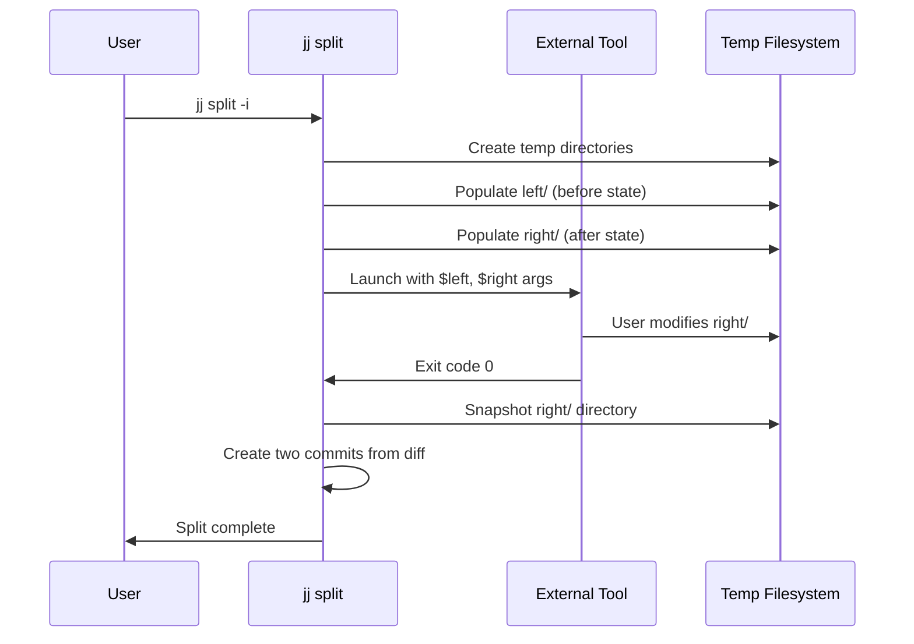
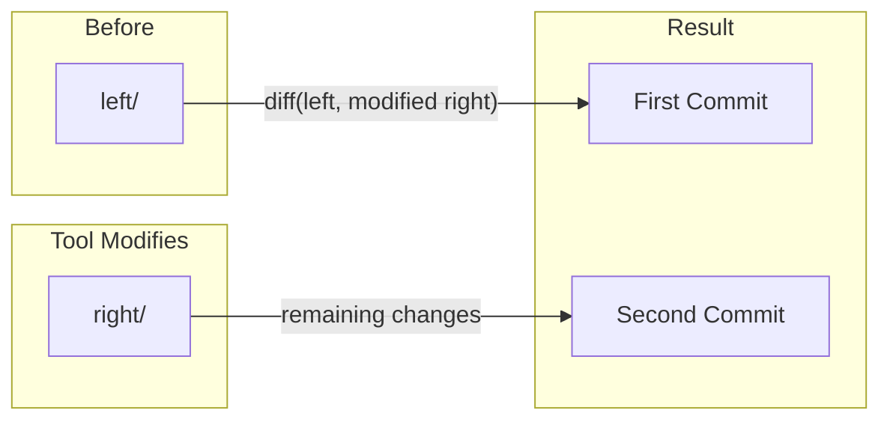

# How `jj split` Delegates to External Tools

This document explains how `jj split` interfaces with external diff editors.

## Overview

When you run `jj split -i` (interactive mode), jj delegates the change selection to an external diff editor tool. The tool receives two directory trees and modifies one of them to indicate which changes should go in the first commit.



## Input to the Tool

The external tool receives **two directories** via command-line arguments:

| Variable | Directory | Purpose                                                    |
| -------- | --------- | ---------------------------------------------------------- |
| `$left`  | `left/`   | **Before state** (read-only) - the original commit's files |
| `$right` | `right/`  | **After state** (editable) - copy of the files to modify   |

### Directory Structure

```
temp_dir/
├── left/                  # Read-only snapshot of the commit before changes
│   ├── src/
│   │   └── main.rs
│   └── README.md
├── right/                 # Editable - the tool modifies this
│   ├── src/
│   │   └── main.rs
│   ├── README.md
│   └── JJ-INSTRUCTIONS    # Optional guidance file (if ui.diff-instructions=true)
├── left_state/            # Internal metadata
└── right_state/           # Internal metadata
```

### The JJ-INSTRUCTIONS File

When `ui.diff-instructions` is enabled (the default), jj writes a `JJ-INSTRUCTIONS` file to the output directory with guidance for the user. This file is automatically ignored when snapshotting the result.

## Output from the Tool

The tool communicates its result by:

1. **Modifying files in the `$right` directory** to reflect what should go in the first commit
2. **Exiting with code 0** to indicate success

### How the Split Works



- **First commit**: Contains changes from `$left` → modified `$right`
- **Second commit**: Contains any remaining changes not included in the first commit

### Exit Codes

| Exit Code | Meaning                                                                     |
| --------- | --------------------------------------------------------------------------- |
| 0         | Success - changes accepted                                                  |
| Non-zero  | Error - operation aborted (unless tool is configured to accept other codes) |

## Configuration

Tools are configured in your jj config file (e.g., `~/.config/jj/config.toml`):

```toml
[ui]
diff-editor = "meld"              # Which tool to use
diff-instructions = true          # Write JJ-INSTRUCTIONS file (default: true)

[merge-tools.meld]
program = "meld"                  # Executable name or path
edit-args = ["$left", "$right"]   # Arguments passed to the tool
```

### Available Variables

| Variable  | Description                                    |
| --------- | ---------------------------------------------- |
| `$left`   | Path to left (before) directory                |
| `$right`  | Path to right (after) directory                |
| `$output` | Path to output directory (for 3-way scenarios) |

### Additional Tool Options

```toml
[merge-tools.mytool]
program = "mytool"
edit-args = ["--left", "$left", "--right", "$right"]
edit-invocation-mode = "dir"      # "dir" or "file-by-file"
edit-do-chdir = true              # Whether to cd to temp dir before running
```

## Example: Writing a Custom Split Tool

A minimal split tool in bash that selects only modified (not added) files:

```bash
#!/bin/bash
# split-modified-only.sh
# Keeps only modifications in first commit, additions go to second

left="$1"
right="$2"

# Remove any newly added files from right/ (they'll go to second commit)
for file in $(find "$right" -type f -name 'JJ-INSTRUCTIONS' -prune -o -type f -print); do
    relative="${file#$right/}"
    if [[ ! -f "$left/$relative" ]]; then
        rm "$file"
    fi
done

exit 0
```

Configure it:

```toml
[merge-tools.split-modified]
program = "/path/to/split-modified-only.sh"
edit-args = ["$left", "$right"]
```

## Key Implementation Details

1. **Only `$right` is modified** - The `$left` side is read-only to prevent accidental changes
2. **Matcher filtering** - Only files matching the fileset/pathspec are included
3. **Conflict markers** - If conflicts exist in the commit, they're materialized in the files
4. **Atomic operation** - The entire split succeeds or fails together

## Source Code References

- Split command: `cli/src/commands/split.rs`
- DiffEditor: `cli/src/merge_tools/mod.rs:235`
- External tool invocation: `cli/src/merge_tools/external.rs:378`
